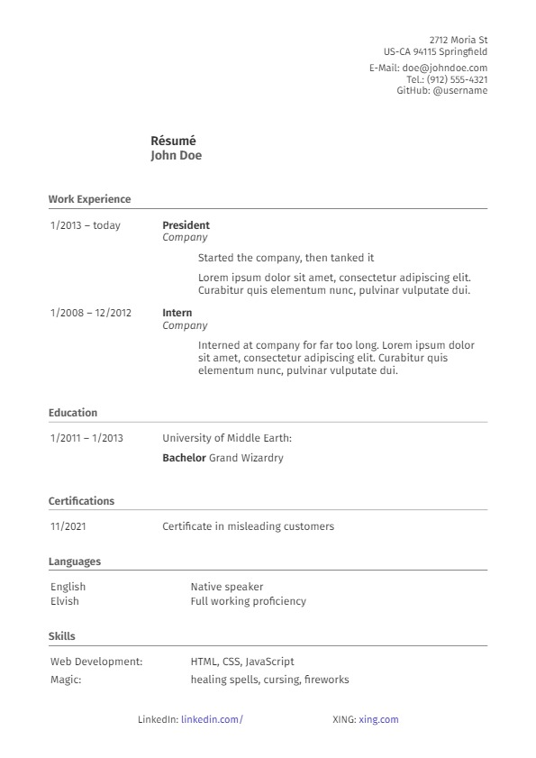

# digicommons-2023

My personal theme for [shaoner/resumy](https://github.com/shaoner/resumy). See example [below](#example)

### Features:

- Multilingual: English, German, Czech included (see [below](#change-template-language) for more info)

Currently, this theme renders/supports the following resume sections of [JSON Schema](https://jsonresume.org/schema/):
| Section		| Supported?	| Unsupported details			|
|---------------|:-------------:|-------------------------------|
| Basics		| &#9989;		| `.image`, `.url`, `.summary`	|
| Work			| &#9989;		| `.summary`					|
| Volunteer		| &#10060;		| `...`							|
| Education		| &#9989;		| `.score`, `.courses`			|
| Certificates	| &#9989;		| 								|
| Publications	| &#10060;		| `...`							|
| Skills		| &#9989;		| `.level`						|
| Languages		| &#9989;		| 								|
| Interests		| &#10060;		| `...`							|
| References	| &#10060;		| `...`							|
| Projects		| &#10060;		| `...`							|

#### Quirks:
- All social media profiles under `basics.profiles` apart from **LinkedIn and XING** are rendered as contact information in the header. LinkedIn and XING as business platforms are prominently placed in the footer.
- Currently the education section displays the education type and area inline as one coherent section. This is based on my personal resume wording in German, but may cause issues in other languages. Therefore please consider this section as under construction.
- Apart from the footer section (see above), links aren't visually highlighted. This could be an accessibility issue, but since the resume is meant to be exported to PDF and possibly printed, I went with increased readability over visual discoverability of links - screen readers should still be able to detect the links.

## Usage & Configuration
### Installation
1. ~~If not installed yet, install resumy as described [here](https://github.com/shaoner/resumy).~~
Currently, shaoner/resumy doesn't support .jinja extensions and won't discover non-default themes. Until the concerning pull requests are merged or changes implemented, you may install/clone an updated fork [here](https://github.com/digicommons/resumy):
```
mkdir YOUR_DIR_NAME
cd YOUR_DIR_NAME
python3 -m venv venv
source venv/bin/activate
pip install git+https://github.com/digicommons/resumy.git
```
2. Clone theme into your working directory, e.g.:
```
mkdir themes
git clone https://github.com/digicommons/digicommons-2023 ./themes/digicommons-2023
```

### Use theme to render resume
```
resumy build -o myresume.pdf --theme /absolute/path/to/theme/directory /path/to/resume.yaml
```

#### Note:
If you install resumy in editable mode (e.g. using `pip install -e` when following [these instructions](https://github.com/digicommons/resumy#development)), you may clone the theme into resumy's `themes` folder. This enables you to use the following build syntax:

```resumy build -o myresume.pdf --theme digicommons-2023 /path/to/resume.yaml```

### Change template language:
To change the template language, edit the language code (e.g. EN, DE, CS) on the first line of `theme.html.jinja`. This imports a localized dictionary from a file in the `i18n` subdirectory:

```jinja

```

Feel free to provide your own translations by adding a language file to the directory and submitting a pull request.

## Development
If you'd like to contribute to this theme, please make your changes to `theme.scss` and then use Sass to compile it to `theme.css`.

```
sass -w path/to/theme.scss path/to/theme.css --no-source-map
```

## Example:

